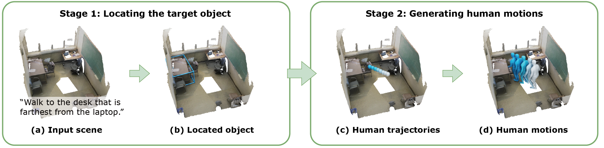

This repo is the official implementation of "Generating Human Motion in 3D Scenes from Text Descriptions".

[arxiv](https://arxiv.org/abs/2405.07784) | [project page](https://zju3dv.github.io/text_scene_motion/)



## News
[2024/11/02] We release the training code.

[2024/10/21] We release the visualization code.

[2024/06/09] We first release the test & evaluation code.
## Installation
```bash
conda create -n most python=3.9
conda activate most
# install pytorch
conda install pytorch==1.13.0 torchvision==0.14.0 torchaudio==0.13.0 pytorch-cuda=11.6 -c pytorch -c nvidia
# install pytroch3d
pip install pytorch3d-0.7.2-cp39-cp39-linux_x86_64.whl
# install other requirements
cat requirements.txt | sed -e '/^\s*-.*$/d' -e '/^\s*#.*$/d' -e '/^\s*$/d' | awk '{split($0, a, "#"); if (length(a) > 1) print a[1]; else print $0;}' | awk '{split($0, a, "@"); if (length(a) > 1) print a[2]; else print $0;}' | xargs -n 1 pip install
# install MoST lib
pip install -e . --no-build-isolation --no-deps
```

NOTE:
1. `pytorch3d` [download link](https://dl.fbaipublicfiles.com/pytorch3d/packaging/wheels/py39_cu116_pyt1130/download.html).
2. If you want to run stage 1, please uncomment `shapely, tenacity, openai, scikit-learn` in requirements.txt.

## Data preparation
### ScanNet dataset
1. Download ScanNet v2 from [link](http://www.scan-net.org/). We only need files that ends with `*_vh_clean_2.ply`, `*_vh_clean.aggregation.json`, `*_vh_clean_2*segs.json`.
2. Link to data/:
```bash
mkdir data
ln -s /path/to/scannet data/ScanNet
```
3. Preprocess by runing:
```bash
python tools/preprocess_scannet.py
```
Files will be saved in data/scannet_preprocess.
### HUMANISE dataset
1. Download HUMANISE dataset from [link](https://github.com/Silverster98/HUMANISE).
2. Link to data/
```bash
mkdir data
ln -s /path/to/humanise data/HUMANISE
```

### AMASS dataset
(Only needed if you want to train the models by yourself.)
1. Please follow [HUMOR](https://github.com/davrempe/humor/tree/main?tab=readme-ov-file#datasets) to download and preprocess AMASS dataset.
2. Link to data/
```bash
ln -s /path/to/amass_processed data/amass_preprocess
```


### SMPLX models
1. Download SMPLX models from [link](https://smpl-x.is.tue.mpg.de/).
2. Put the smplx folder under ```data/smpl_models``` folder:
```bash
mkdir data/smpl_models
mv smplx data/smpl_models/
```

### Pretrained models
1. Weights are shared in [link](https://drive.google.com/file/d/1tftqacTRZoLfpZiNqGyDQPJlU7KnrQt6/view?usp=sharing). Please download and unzip it and put the folder most_release under ```out``` folder:
```bash
mv most_release out/release
```

## Stage 1: locating the target object
### Object bounding box detection
Here, we use ground truth object detection results for ScanNet scenes (in the HUMANISE dataset).
If you want to test on a new scene, please follow [GroupFree3D](https://github.com/zeliu98/Group-Free-3D) to get object bounding boxes.

### Inference the target object
```bash
python tools/locate_target.py -c configs/locate/locate_chatgpt.yaml
```
We use Azure OpenAI service, please refer to this [link](https://learn.microsoft.com/en-us/azure/ai-services/openai/how-to/create-resource?pivots=web-portal) and this [link](https://learn.microsoft.com/en-us/azure/ai-services/openai/how-to/switching-endpoints).

## Stage 2: generating human motions
### Testing

#### Generating results
```bash
python tools/generate_results.py -c configs/test/generate.yaml
```
The results will be saved in ```out/test```.
#### Evaluation
```bash
python tools/evaluate_results.py -c configs/test/evaluate.yaml
```

#### Visualization
The generated results are shared in [link](https://drive.google.com/file/d/1zrpzJltY9bseKV3BGuZZpmmtQRT7rQye/view?usp=sharing). You can use your own generated results or download it and unzip it as ```out/test``` folder.

We use [wis3d](https://pypi.org/project/wis3d/) lib to visualize the results.
To prepare for the visualization:
```bash
python tools/visualize_results.py -c configs/test/visualize.yaml
```
Then, in terminal:
```bash
wis3d --vis_dir out/vis3d --host ${HOST} --port ${PORT}
```
You can then visualize the results in ```${HOST}:${PORT}```.


# Train the models by yourself
## Pretrain on the AMASS dataset
Train the trajectory model:
```bash
python tools/train.net -c configs/train/trajgen/traj_amass.yaml task amass_traj
```
Train the motion model:
```bash
python tools/train.net -c configs/train/motiongen/motion_amass.yaml task amass_motion
```
The outputs and models will be saved in ```out/train/```
## Finetune on the HUMANISE dataset
Train the trajectory model:
```bash
python tools/train.net -c configs/train/trajgen/traj_humanise.yaml task humanise_traj resume True resume_model_dir out/train/amass_traj/model
```
Train the motion model:
```bash
python tools/train.net -c configs/train/motiongen/motion_humanise.yaml task humanise_motion resume True resume_model_dir out/train/amass_motion/model
```
# Citation

```
@inproceedings{cen2024text_scene_motion,
  title={Generating Human Motion in 3D Scenes from Text Descriptions},
  author={Cen, Zhi and Pi, Huaijin and Peng, Sida and Shen, Zehong and Yang, Minghui and Shuai, Zhu and Bao, Hujun and Zhou, Xiaowei},
  booktitle={CVPR},
  year={2024}
}
```